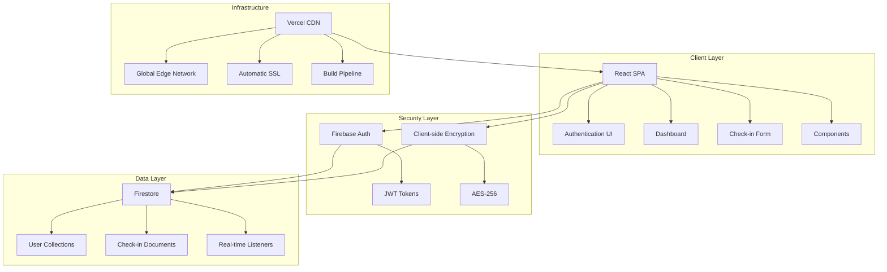
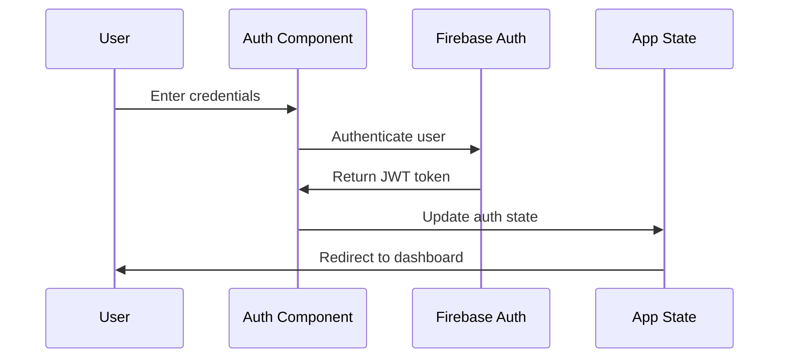
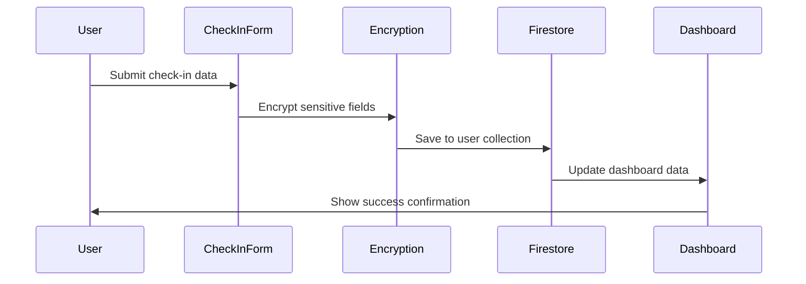
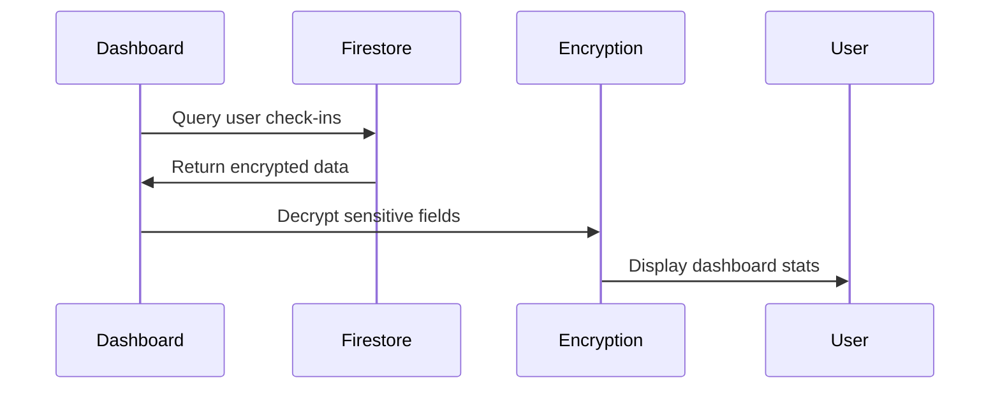

# 🏗️ Application Architecture

<div align="center">
  
  
  
  
</div>

## 🎯 Overview

The Mental Health Check-in application follows a **modern single-page application (SPA)** architecture, leveraging React for the frontend and Firebase services for backend functionality. This architecture provides scalability, security, and real-time capabilities while maintaining simplicity and cost-effectiveness.

## 📐 High-Level Architecture



## 🏢 System Components

### 🎨 **Frontend Layer (React)**

#### **Core Components**

| Component           | Purpose                       | Key Features                             |
| ------------------- | ----------------------------- | ---------------------------------------- |
| **App.jsx**         | Main application orchestrator | Route management, authentication state   |
| **Auth.jsx**        | Authentication interface      | Login/signup forms, Firebase integration |
| **Dashboard.jsx**   | User statistics and overview  | Data visualization, check-in history     |
| **CheckInForm.jsx** | Daily check-in interface      | Form validation, data collection         |
| **Slider.jsx**      | Reusable rating component     | Interactive rating input (1-10)          |

#### **File Structure**

```
src/
├── components/
│   ├── App.jsx              # Main app component
│   ├── Auth.jsx             # Authentication forms
│   ├── Dashboard.jsx        # User dashboard
│   ├── CheckInForm.jsx      # Daily check-in form
│   └── Slider.jsx           # Rating slider component
├── firebase/
│   └── firebase.js          # Firebase configuration
├── styles/
│   └── index.css            # Global styles & responsive design
├── utils/
│   └── encryption.js        # Client-side encryption utilities
└── index.html               # Application entry point
```

### 🔐 **Authentication Layer**

#### **Firebase Authentication**

- **Provider**: Email/Password authentication
- **Token Management**: JWT tokens stored in browser
- **Session Handling**: Automatic token refresh
- **Security Rules**: User-specific data access

```javascript
// Authentication Flow
User Login → Firebase Auth → JWT Token → Authorized Access
```

### 🛡️ **Security Layer**

#### **Data Encryption**

```javascript
// Client-side encryption implementation
import CryptoJS from "crypto-js";

const encryptData = (data) => {
  return CryptoJS.AES.encrypt(
    JSON.stringify(data),
    process.env.VITE_ENCRYPTION_KEY
  ).toString();
};

const decryptData = (encryptedData) => {
  const bytes = CryptoJS.AES.decrypt(
    encryptedData,
    process.env.VITE_ENCRYPTION_KEY
  );
  return JSON.parse(bytes.toString(CryptoJS.enc.Utf8));
};
```

#### **Security Measures**

- 🔒 **AES-256 Encryption** for sensitive data
- 🔑 **Environment-based** encryption keys
- 🚫 **Firestore Security Rules** for data access control
- 🛡️ **HTTPS enforcement** across all communications

### 🗄️ **Database Layer (Firestore)**

#### **Data Model**

```javascript
// Firestore Collection Structure
users/
├── {userId}/
│   ├── profile/
│   │   ├── email: string
│   │   ├── createdAt: timestamp
│   │   └── lastLogin: timestamp
│   └── checkins/
│       └── {checkinId}/
│           ├── date: timestamp
│           ├── mood: number (1-10)
│           ├── stress: number (1-10)
│           ├── energy: number (1-10)
│           ├── sleep: number (1-10)
│           ├── feelings: string (encrypted)
│           ├── gratitude: string (encrypted)
│           └── goals: string (encrypted)
```

#### **Security Rules**

```javascript
// firestore.rules
rules_version = '2';
service cloud.firestore {
  match /databases/{database}/documents {
    match /users/{userId} {
      allow read, write: if request.auth != null
        && request.auth.uid == userId;

      match /checkins/{checkinId} {
        allow read, write: if request.auth != null
          && request.auth.uid == userId;
      }
    }
  }
}
```

## 🔄 Data Flow Architecture

### **1. User Authentication Flow**



### **2. Check-in Submission Flow**



### **3. Dashboard Data Retrieval**



## 🏗️ Infrastructure Architecture

### **Vercel Deployment**

```
Developer Push → GitHub → Vercel Build → Edge Network → User
```

#### **Build Pipeline**

1. **Source Code**: GitHub repository
2. **Build Process**: Vite bundler
3. **Optimization**: Code splitting, minification
4. **Deployment**: Global CDN distribution
5. **SSL**: Automatic certificate provisioning

#### **Performance Features**

- ⚡ **Edge Computing**: Global CDN distribution
- 🔄 **Automatic Builds**: Git integration
- 📊 **Analytics**: Performance monitoring
- 🚀 **Optimized Bundles**: Code splitting and lazy loading

## 🔧 Technical Specifications

### **Frontend Technologies**

| Technology      | Version | Purpose              |
| --------------- | ------- | -------------------- |
| React           | 18.2.0  | UI framework         |
| Vite            | Latest  | Build tool           |
| CSS3            | Latest  | Styling              |
| JavaScript ES6+ | Latest  | Programming language |

### **Backend Technologies**

| Service       | Purpose             | Features                             |
| ------------- | ------------------- | ------------------------------------ |
| Firebase Auth | User authentication | Email/password, JWT tokens           |
| Firestore     | Database            | NoSQL, real-time, scalable           |
| Firebase SDK  | Client library      | Real-time listeners, offline support |

### **Security Technologies**

| Technology     | Purpose            | Implementation            |
| -------------- | ------------------ | ------------------------- |
| CryptoJS       | Data encryption    | AES-256 client-side       |
| Firebase Rules | Access control     | User-specific data access |
| HTTPS          | Transport security | SSL/TLS encryption        |

## 🎯 Design Principles

### **1. Security First**

- All sensitive data encrypted before storage
- User authentication required for all operations
- Principle of least privilege access

### **2. Scalability**

- Serverless architecture for automatic scaling
- NoSQL database for flexible data models
- CDN distribution for global performance

### **3. User Experience**

- Responsive design for all devices
- Real-time data synchronization
- Offline-first approach (planned)

### **4. Maintainability**

- Modular component architecture
- Clear separation of concerns
- Environment-based configuration

## 🚀 Performance Considerations

### **Frontend Optimization**

- **Code Splitting**: Automatic route-based splitting
- **Lazy Loading**: Components loaded on demand
- **Asset Optimization**: Image compression, minification
- **Caching Strategy**: Browser and CDN caching

### **Database Optimization**

- **Efficient Queries**: Indexed field queries
- **Data Modeling**: Optimized for read patterns
- **Connection Management**: Persistent connections
- **Real-time Updates**: Efficient change listeners

## 🔮 Future Enhancements

### **Technical Improvements**

- [ ] **Service Worker** for offline support
- [ ] **PWA Features** for mobile app experience
- [ ] **Real-time Analytics** dashboard
- [ ] **Data Export** functionality
- [ ] **Multi-language Support** internationalization

### **Architecture Evolution**

- [ ] **Microservices** for advanced features
- [ ] **GraphQL** for efficient data fetching
- [ ] **Machine Learning** for insights
- [ ] **Push Notifications** for reminders

## 🏆 Architecture Benefits

### **Advantages**

- ✅ **Rapid Development**: Minimal backend setup
- ✅ **Cost Effective**: Pay-per-use pricing
- ✅ **Scalable**: Automatic scaling with demand
- ✅ **Secure**: Built-in security features
- ✅ **Maintainable**: Clean separation of concerns

### **Trade-offs**

- ⚠️ **Vendor Lock-in**: Firebase dependency
- ⚠️ **Limited Customization**: Serverless constraints
- ⚠️ **Client-side Logic**: Heavier frontend processing

---

<div align="center">
  <p>🏗️ <strong>Architecture designed for scalability, security, and user experience</strong></p>
  <p>For technical questions, contact: <a href="mailto:nawaidwork@gmail.com">nawaidwork@gmail.com</a></p>
</div>
